#### These procedure steps will be followed on the simulator

1. When you click on Alum Coagulation simulation file, a new window will open as shown below, hover on "Description" and "Solutions used" label to understand the terminologies and reagents used in the experiment. Click on NEXT button to proceed. 
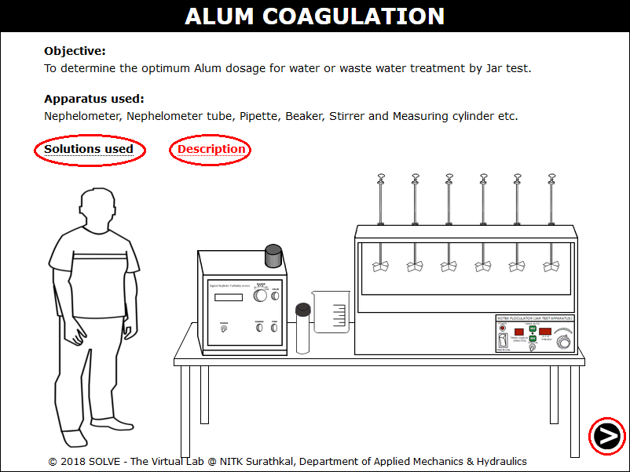 

2. Click on the water sample measuring cylinder to add 500ml of it to the beaker. 
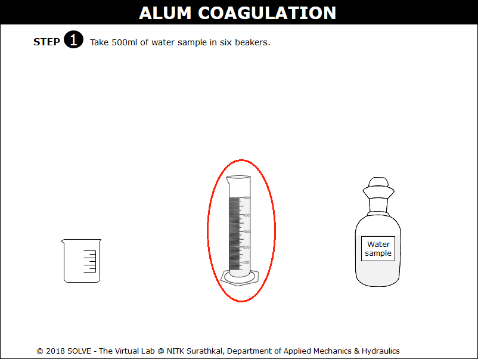 

3. Answer the question by selecting the correct answer, click on NEXT button to proceed with the simulation. 
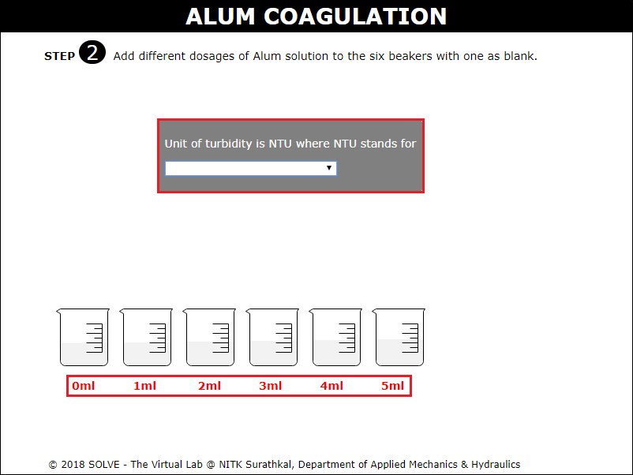 

4. Click on the graduated pipette to add different dosage of Alum to all the six beakers keeping one beaker as blank. 
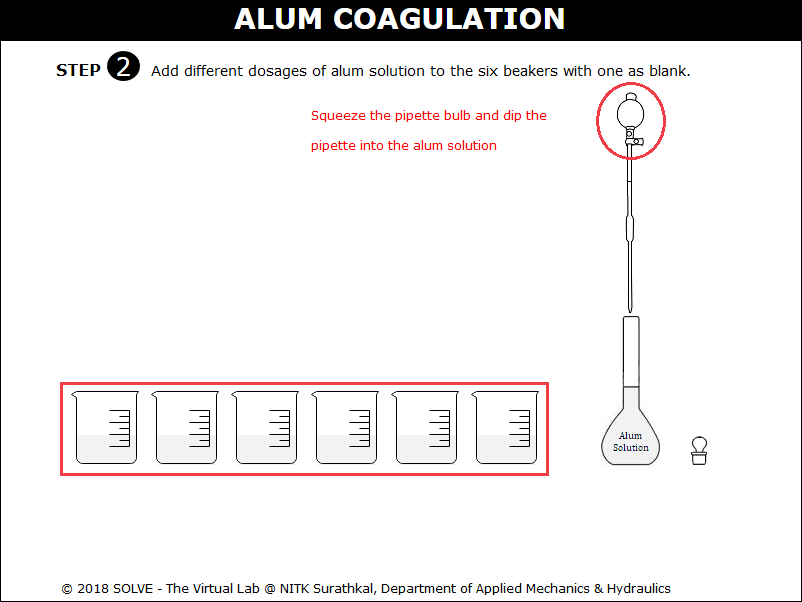 

5. Go through the instruction given, then click on OK to proceed with the simulation. 
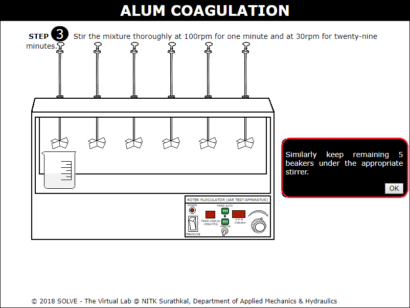 

6. Click on the beaker to place it on magnetic stirrer and is stirred at 100rpm for 1 minute and at 30rpm for 29 minutes. 
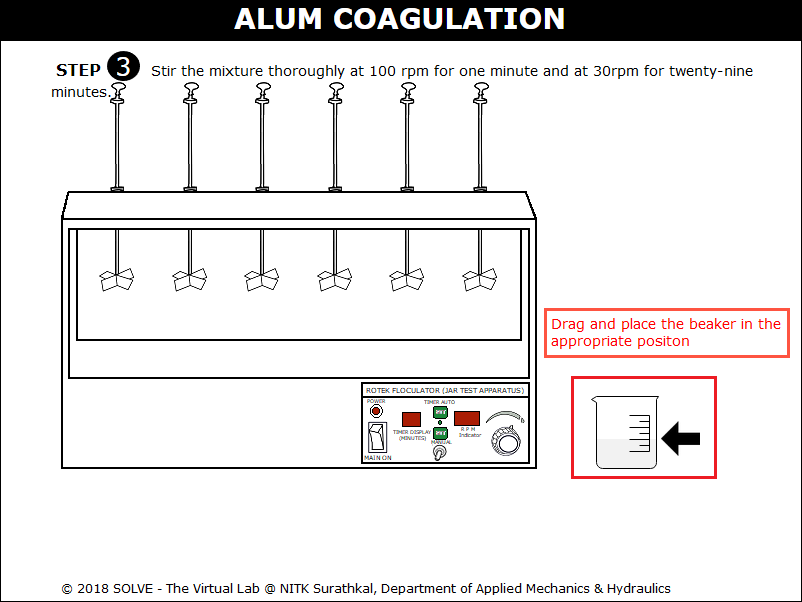 

7. Click on the timer and speed to set it then allow magnetic stirrer to stir the sample. 
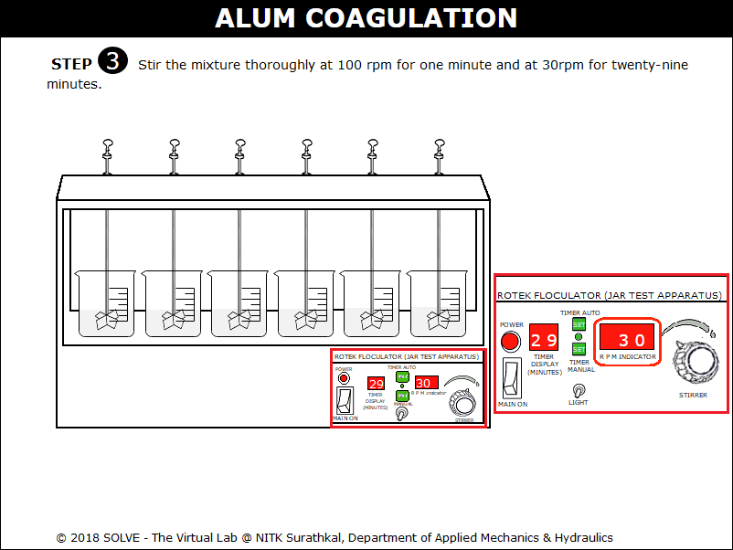 

8. Once the samples are stirred, click on the beakers to remove all of them from magnetic stirrer and then add the sample to Nephelometer tubes, click on NEXT button to proceed. 
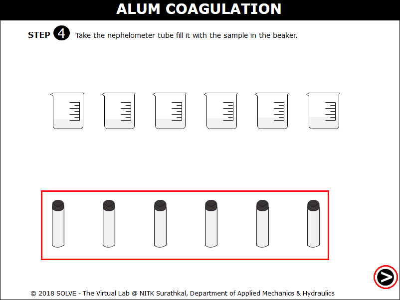 

9. In order to calibrate the Nephelometer, click on the Nephelometer tube containing distilled water to place it and click on coarse adjusting knob and set the Turbidity value to zero. 
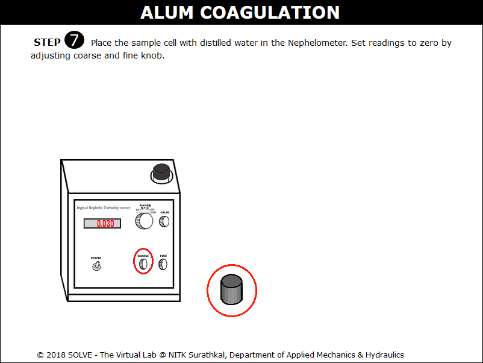 

10. Place the 100NTU solution and click on fine adjusting knob to set the Turbidity value to 100. 
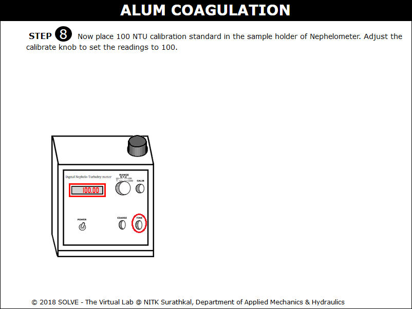 

11. Now measure the Turbidity of the sample by placing the samples in the Nephelometer. 
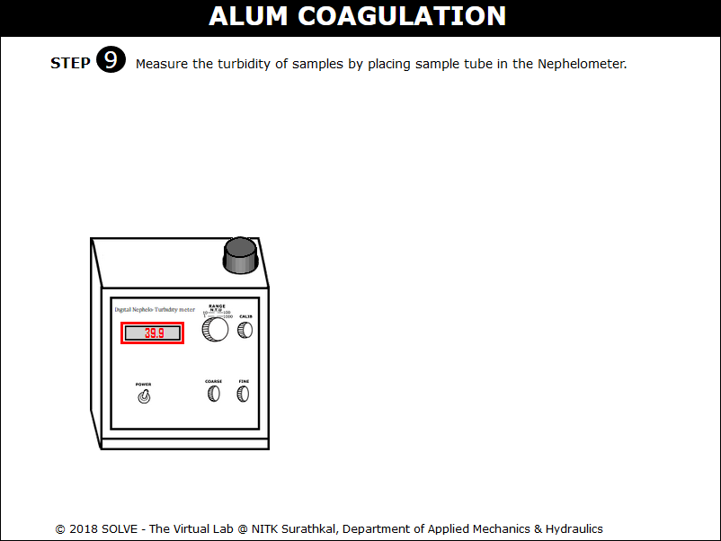 

12. Similarly find the Turbidity values of all the samples, click on NEXT button to proceed. 
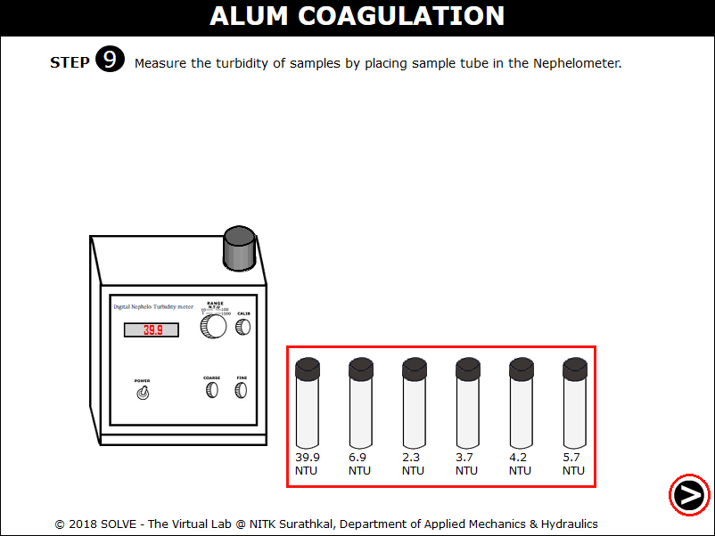 

13. Click on the hint provided and calculate all the Alum dosage values, click on result to verify the obtained value. 
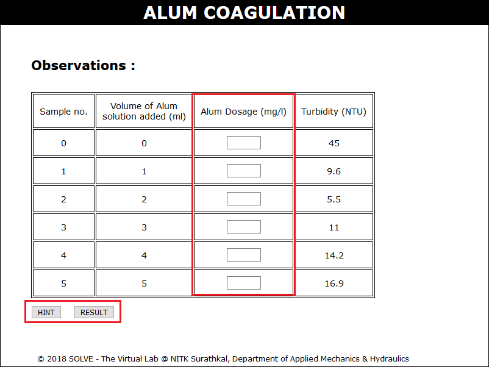 

14. Note down the Turbidity value of all the samples, click on NEXT button. 
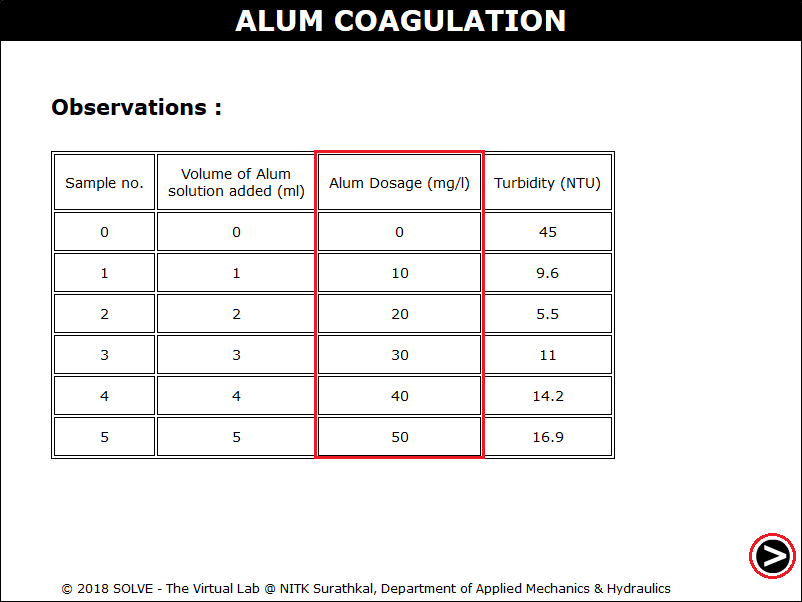 

15. Obtain the graph of Turbidity value v/s Alum dosage and find the optimum dosage value, click on NEXT button to proceed. 
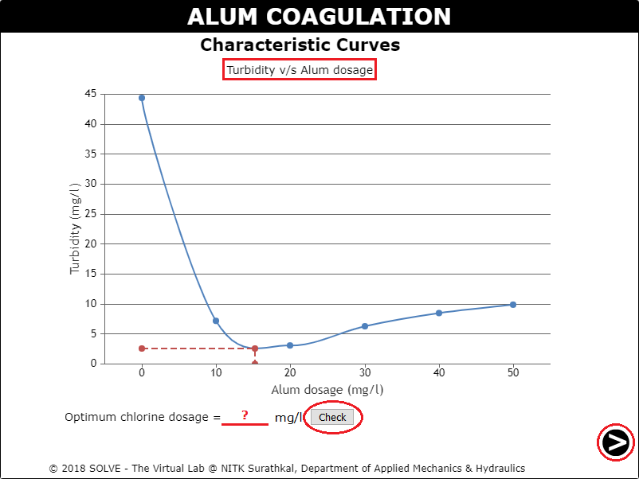 

16. Go through the Inference drawn from the obtained result. 
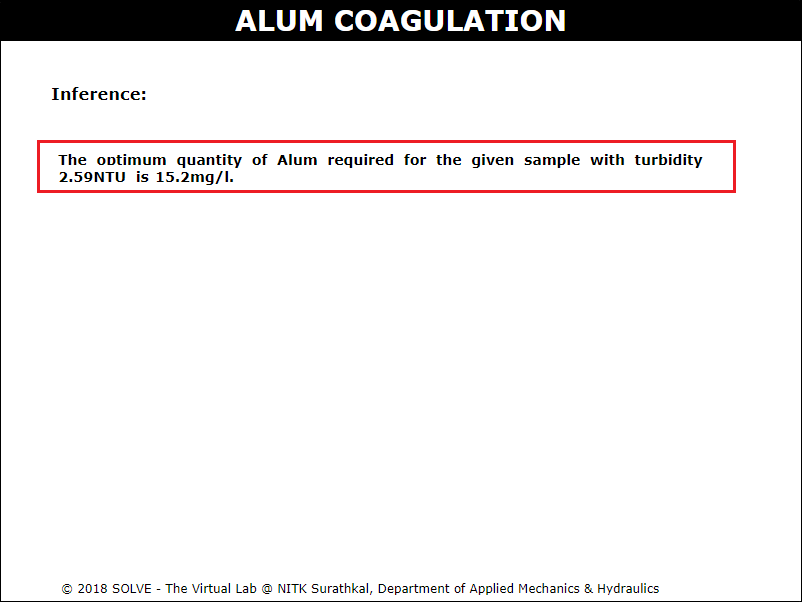 
